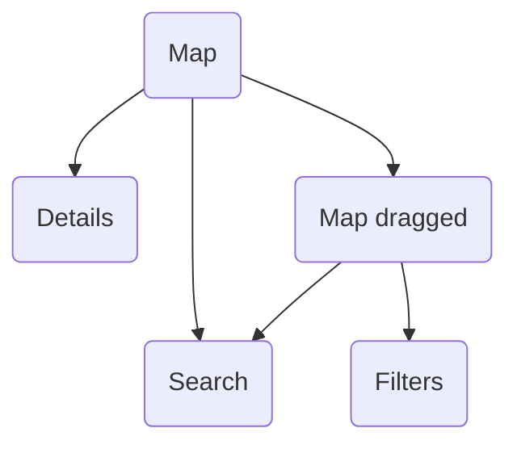

# Around Me Screens

## Screen flow

Refer to the following schema to learn more about different interactions and how to navigate between module screens:

## Map

The map screen represents the main screen of this module. It shows the places nearby the center of the visible region, draws them on the map and adds them to the bottom sliding panel. 
The shown data depend on the selected elements in the [filters](#filters) screen.

In the bottom sheet of the main screen, the last added favorite stations are shown with the next departures for each direction, as well as an All Favorites button that redirects the user to the bookmark module. In the same section, if the user has added his journeys to favorites in journey module, a favorite journeys section appears showing the list of bookmarked journeys.

=== "Android"

    

=== "iOS"

    

In the details bottom sheet of a station or a POI, there is a star button in order to save or delete it from the bookmarks.

=== "Android"

    

=== "iOS"

    

## Map dragged

!!! failure "404"

    This section is not written yet

## Search

The search screen allows the user to seek for a place using a built-in autocompletion. The result is a selection of addresses, stations and points of interest based on the user search input text. 
If an element is selected, this screen will disappear and the map will be centered over the selected item location.
Please note that a history feature is added to this screen, allowing the user to choose from the previous selected items. The `maxHistory` parameter defines the maximum number of items to show in the history list.

=== "Android"

    

=== "iOS"
    
    

## Filters

This screen content is a visual version of the passed transport categories and POI categories configuration (check [modules configuration](../../getting_started/#modules-configuration) section for more information). The selected elements will be used to filter the data received and drawn within the map. One filter should at least be selected or else the user can't apply the current filters configuration.

=== "Android"

    

    If you want to reset the user filters configuration, you can simply call `AroundMeUI.getInstance().resetUserPreferences()` and the current configuration will be deleted and the screen will be updated according to the new passed configuration.

=== "iOS"

    
