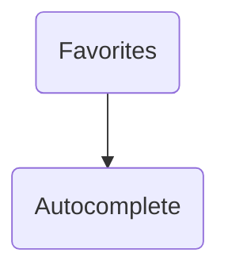

# Bookmark Screens

## Screen flow

Refer to the following schema to learn more about different interactions and how to navigate between module screens:

## Favorites

This screen lists all the favorite stations, Bike sharing service stations, car parkings and addresses added by the user through other UI modules (Around Me, Schedule...) or from within a 3rd party application.

=== "Android"

    

=== "iOS"
    
    

## Autocomplete

=== "Android"

    

=== "iOS"
    
    

