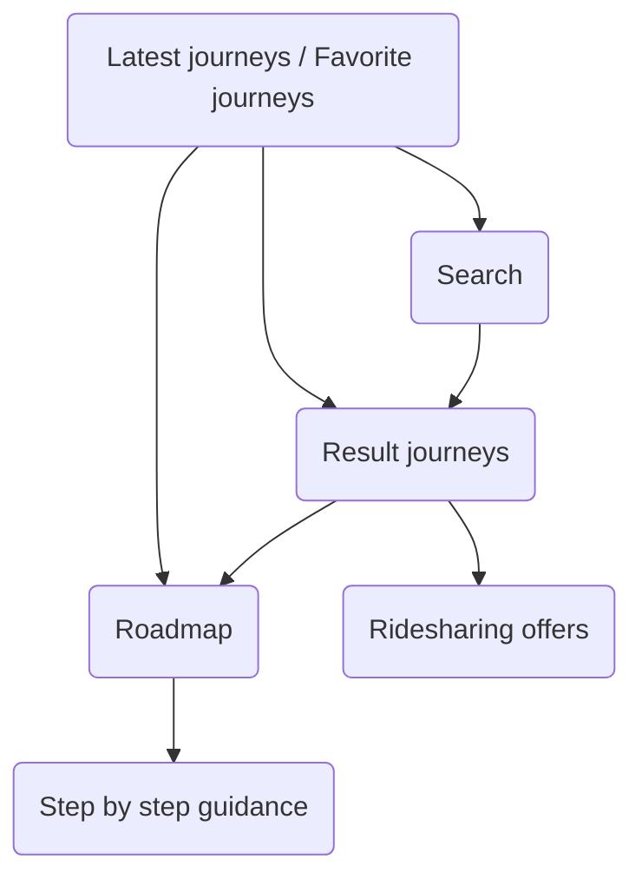

# Journey Screens

## Screen flow

Refer to the following schema to learn more about different interactions and how to navigate between module screens:

## Latest journeys / Favorite journeys

## Result journeys

The journeys screen is fundamental and offers the solutions to the user for the requested itinerary.
After defining all the required parameters, this screen will popup with multiple results combining public transport, personal bikes/cars, bike sharing system and even ridesharing possibilities.

Each result gives the needed information to the user in order to planify his journey. He can check the duration, the suggested means of transport, the next departure datetimes and many other useful details. This combination of data, being served by <a href="https://doc.navitia.io" target="_blank">Navitia</a> servers and translated into a comprehensible/user friendly interface, is perfectly shaped to the user profile and needs.

The journeys are grouped into categories represented by different tabs: public transport, walking, bike, car and ridesharing. The visibility of each tab depends on the passed [transport categories configuration](../../getting_started/#transport-category). 
In the public transport tab, the journeys are grouped in two sections: recommended journeys and other journeys. The recommended journey ensures to the user that the arrival date is respected and yet, the journey is reliable. 

=== "Android"

    

=== "iOS"

    

In the bike tab, the bike journeys are classified depending on specific criteria: the fastest, the most comfortable and the most balanced. The cycling path percentage is also displayed to the user to help him choose the right journey. In the same tab, the journeys combining only bike sharing service and walking are also added.

=== "Android"

    

=== "iOS"

    

Each made itinerary request is saved and shown to the user at the screen launch. The history can be easily deleted by choosing delete from the action menu of the target item. 
In the same screen, we also show the list of the favorite journeys that the user has added using the bookmark button (see [Roadmap](#roadmap) section below). To enable this feature, the `bookmark_mode`parameter should be set to `true` in [Journey features](../../getting_started/#journey-features).

=== "Android"
    
    

=== "iOS"

    

## Search

The search feature can be enabled in the configuration by setting the parameter `search_only` to `false` as mentioned in the [Journey features](../../getting_started/#journey-features) section. 
In this screen, the user can choose the departure and the arrival of his itinerary. While typing in the target field, a list of options is shown below the field. The user can simply choose one of the suggested options and mark it as a departure or as an arrival point. 

The suggested options are grouped in sections, it's whether a station, an address or a place.
In this screen, a geolocation service is used to get the user location. Therefore, another option is given and it allows the user to set his position as a departure or an arrival of the itinerary. 

A history feature is added to this screen, allowing the user to choose from the previous selected items. The `maxHistory` parameter defines the maximum number of items to show in the history list.

If `bookmark_mode` feature is enabled in the [Journey features](../../getting_started/#journey-features), a bookmark section appears in the same screen allowing the user to choose from his favorite addresses/places. A shortcut button is also available for Home and Work favorites.

=== "Android"

    

=== "iOS"

    

## Roadmap

We believe that the user needs more useful details about his journey and that's where the roadmap screen comes in. In this page, the user gets a visual overview about the selected itinerary with a simple colorful drawing on a map. Departure and arrival markers are also shown on the map along with the user location and itinerary segments delimiters.

The screen also includes a draggable bottom sheet which offers a step-by-step journey sections. Each section is represented in a way that it makes it easier to the user to follow the given instructions. The public transport section is also well detailed when it comes to explain to the user how to take different means of transport from the departure to the arrival point.

A customized button can be added in case an external action needs to be made from outside this screen. To enable this button, the parameter `buy_tickets` should be set in [Journey features](../../getting_started/#journey-features).

=== "Android"

    

=== "iOS"

    

## Ridesharing offers

This screen lists the different ridesharing offers for the selected journey. Regardless of the fact that the journey can propose a full ridesharing trip or a partial ride, the user can select among different third party offers. He has all the information needed to choose the best offer that fits his needs including the departure time, the available seats, the price and some data about the driver offering the ride.

=== "Android"

    

=== "iOS"

    

## Step by step guidance

This screen shows the different steps that the user should go through to reach his destination. Those steps are designed to be simple and easily readable for the user and focuses on the most important information during his journey.
Along with the user location, an interaction between the map and the step card is also added to zoom over the current portion of path that refers to the current selected card.

The journey duration and the estimated arrival time are realtime-updated variables which depend on various parameters such as the highlighted step, the next departure of each public transport mode...

=== "Android"
    
    

=== "iOS"

    
