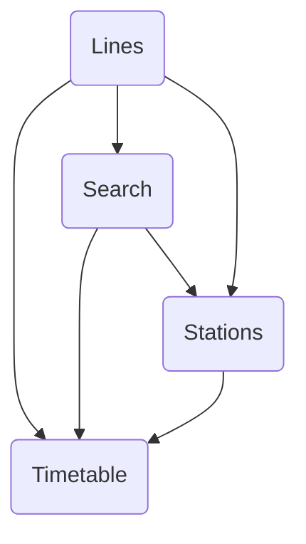

# Schedule Screens

## Screen flow

Refer to the following schema to learn more about different interactions and how to navigate between module screens:

## Lines

The lines screen allows the user to see all the lines of the defined coverage. The lines are sorted by the different configurable transport categories. 
Another filter is added for each transport mode in the selected transport category. 

The lines can also be grouped by networks. To enable this feature, you need to switch the `transport_networks` parameter to `true` in the [features configuration](../../getting_started/#schedule-features). 

=== "Android"

    

=== "iOS"

    

If there is any favorite station, an additional tab will be shown listing all bookmarked stations. Each station has a maximum of 3 next departures by destination or an empty state if data is unavailable.

=== "Android"

    

=== "iOS"

    

## Search

The search screen allows the user to seek for a station or a line using a built-in autocompletion. The result is based on the user search input text. 
The station result combines both the name of the station and all the lines passing through that station. This will allow the user to select directly the searched line and get the list of all destinations starting from the target station point. 

A history feature is added to this screen, allowing the user to choose from the previous selected items. The `maxHistory` parameter defines the maximum number of items to show in the history list.

=== "Android"

    

=== "iOS"

    

## Stations

The station screen lists all the stations of the selected line alphabetically sorted. A search feature is added to filter the lines and makes it easier for the user to search for the desired station. 
In case the `directions_first` parameter is set to `true` in the [features configuration](../../getting_started/#schedule-features), this screen will show all stations of a defined route (destination).

=== "Android"

    

=== "iOS"

    

## Timetable

This screen allows the user to see the next departures of the target transport mode through the selected station which is heading to the chosen destination. The map gives more details about the vehicle journey by drawing the line path and both selected station and destination markers. 

=== "Android"

    

=== "iOS"

    

The user can also bookmark this selected station by taping the Favorite button on the bottom-right corner of the map. To enable this feature, you need to switch the `bookmark_mode` parameter to `true` in the [features configuration](../../getting_started/#schedule-features). 

=== "Android"

    

=== "iOS"

    

When the user taps on the All schedules button in the [next departures](#next-departures) screen, the all schedules screen shows up and gives all theoretical departures of the selected line from the selected station to the target destination. 

This screen includes a datepicker button allowing the user to choose a date and see all the scheduled departures on that date.

=== "Android"
    
    

=== "iOS"

    
