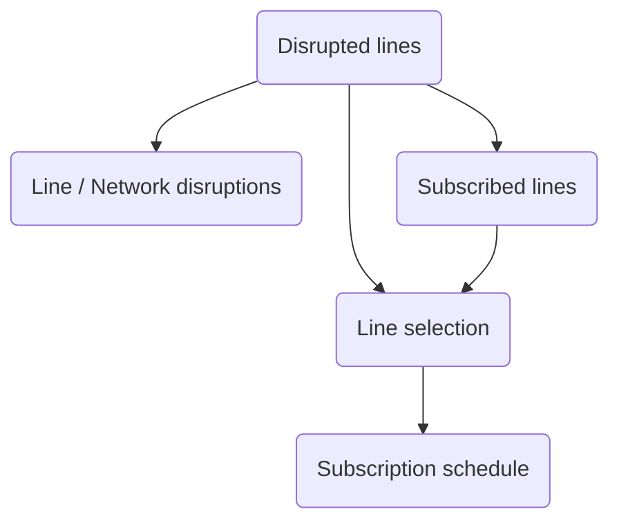

# Traffic Screens

## Screen flow

Refer to the following schema to learn more about different interactions and how to navigate between module screens:

## All disruptions

The all disruptions screen allows the user to view all the line and network disruptions sorted by transport category. 
When clicking on a disrupted line, it redirects the user to the [line disruptions](#linenetwork-disruptions) screen.

=== "Android"

    

=== "iOS"

    

### Filters

The all disruptions screen integrated a menu accessible through the header right button. This menu shows the different transport categories with a default selection. 
If the user hits the _Apply_ button after changing the selection state, the all disruptions screen will refresh and will show the disruptions according to the updated filters.

=== "Android"

    

=== "iOS"

    

## Line/network disruptions

This screen lists the disruptions related to the selected line or to all disrupted networks. Each element shows the title, the message and the application period of a target disruption. 
Some disruptions have messages with included hyperlinks. Those links are also accessible to the user and will redirect him to an external browser to view the related link. 

If the [alert subscription](#alert-subscription) feature is enabled, a bell button appears allowing the user to subscribe/unsubscribe to/from the line alerts.

=== "Android"

    

=== "iOS"

    

## Line selection

This screen includes an autocompletion that enables the user to search the transport line needed for alert subscription. 
The parameter [`transport_networks`](../../getting_started/#traffic-features) allows to show the network providing the searched line. 

=== "Android"

    

=== "iOS"

    

## Subscription schedule

After selecting a line from the autocompletion screen, this screen appears giving the ability to the user to choose/modify the periods in which the alert subscription can be received. 
Please verify that you have passed valid [Kronos API credentials](#traffic-alert-subscription-credentials) to the module initialization method in order to ensure a successful alert subscription process.

=== "Android"

    

=== "iOS"

    

## Subscriptions list

This screen lists all the alert subscriptions that the user have registered. The subscriptions are also grouped by transport categories allowing to filter the subscriptions depending on the impacted line transport mode.

=== "Android"

    

=== "iOS"

    